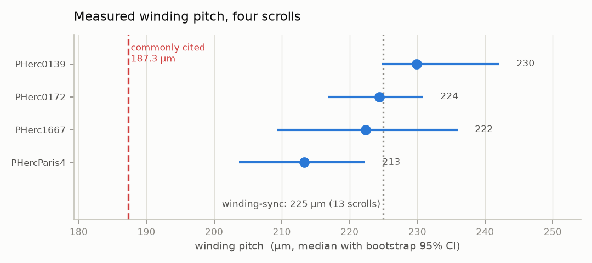

# sheetcheck

Geometric measurement of traced papyrus surfaces in Herculaneum scroll CT data.

`sheetcheck` measures how a traced surface (`tifxyz`) sits inside the CT volume
it was traced from: how far it is from the papyrus it claims to follow, how the
wraps are spaced around it, and how well-resolved the sheet structure is in that
neighbourhood. It streams directly from the public Vesuvius Challenge S3 bucket,
so nothing has to be downloaded in bulk.

It was built to answer a specific question from the 2026 Open Problems list --
whether **surface misplacement** explains ink-detection failures -- and along
the way it produced a set of measurements about the published traces that had
not been written down anywhere.

## What it found

Full detail, with methods and confidence intervals, in
**[FINDINGS.md](FINDINGS.md)**.

### Surface placement does not explain ink-detection failure

Published ink rasters turn out to be **pixel-exact with tifxyz grids at 20x** --
mesh cell `(v, u)` owns ink pixels `[20v:20v+20, 20u:20u+20]`, with no
registration or interpolation. That is not documented anywhere, and it makes
placement and ink directly comparable cell by cell.

Doing so across offsets spanning 0-150 um gives a correlation with ink contrast
of **-0.045**:


Open Problem 6 lists six candidate causes for ink models failing to generalise
and states they cannot be told apart. **Surface misplacement is ruled out** at
the scale published traces actually exhibit -- consistent with ink models
sampling a stack of layers around the surface, which makes them robust to
modest offset by construction.

### Wrap-gap structure is a scroll property; planarity is a resolution artefact

One scroll resolves a papyrus/air split on only 2% of rays while others manage
100%. The obvious explanation -- that it is the only one scanned coarsely -- is
wrong. Degrading a fine scan through the OME-Zarr pyramid, with scroll, segment,
trace and scan all fixed, leaves gap structure at 100% even at 18 um voxels,
which is *coarser* than the 2% scan:


So `gap_structure_frac` measures the scroll, not the sampling. Planarity does
the opposite -- it shifts 0.77 -> 0.92 over the same 8x range on identical data,
so ranking scans by planarity yields a resolution ranking wearing a quality
label.

### The winding pitch is larger than the commonly cited figure

Measured at 213-230 um across four scrolls, every bootstrap 95% interval
excluding 187.3 um:



**This has been found independently.**
[winding-sync](https://github.com/abundantjoe/winding-sync) reports 225 um
(range 207-259) across all 13 Grand Prize scrolls using a different method --
lamina crossing counts rather than autocorrelation period. Two implementations
agreeing to within 1% is good evidence the number is real; the credit for
breadth is theirs, with 13 scrolls to these four.

What this repository adds is the robustness argument. The measurement is
**stable across an 8x change in voxel size** (222 / 221 / 222 / 218 um from
2.26 to 18.06 um voxels), which bears directly on winding-sync's stated
limitation that "the lamina counter varies with resolution". And the obvious
objection -- that perpendicular and radial pitch are different quantities -- was
tested by measuring both on the same rays: they differ by 2.4%, against a ~28%
discrepancy, so the convention cannot account for the gap.

The 187.3 um figure is a distribution of *per-scroll medians*, not a
within-scroll tolerance; used as one it is 10-15% too tight. Within a single
scroll the pitch varies roughly two-fold.

### What the measurements look like on real CT

Every claim above rests on detecting papyrus sheets along the surface normal, so
here is that detection on real data rather than described:


The detector lands on genuine intensity peaks. The traced surface (red) sits on
a sheet in some rays and in a low region in others, which matches the measured
spread in `support` and is consistent with the Challenge team's note that
surface predictions lie on the recto face and "do not always perfectly follow
every small wobble".

This view also exposes a limitation the summary statistics hid: rays 1 and 5
contain large featureless stretches yet still pass the gap-structure test,
because the *other* half of the ray carries enough contrast. `gap_structure_frac`
is therefore a per-ray verdict, not a guarantee that the whole ray is
well-resolved.

### Five hypotheses were tested and rejected

Including the sheet-switch detector this repository is named after. FINDINGS.md
records what failed and why, since knowing which approaches do not work has
value too.

## Why this exists

[Open Problem 6](https://scrollprize.org/2026_open_problems) states that when
ink models fail to generalise, it is unclear whether the cause is *scan quality,
surface misplacement, label mismatch, architecture limits, ink morphology
variation, or fundamental signal absence*. Six hypotheses, no way to tell them
apart.

Surface misplacement is the one that is purely geometric, so it is the one that
can be settled by measurement rather than by training another model. This
repository settles it, and reports several other quantities needed to do so.

## Install

```bash
pip install -e .
```

Python 3.10+. No credentials are needed -- the open-data bucket is public and
is read anonymously.

## Quick start

```bash
python scripts/m3_survey.py --scrolls PHerc1667 --patches 10
```

This discovers a traced segment, pairs it with the exact CT volume it was
registered against, samples rays along the surface normal, and reports the
placement and geometry statistics for that trace.

## What it measures

For each sampled point on a traced surface, `sheetcheck` casts a ray along the
surface normal and measures:

| Quantity | Meaning |
| --- | --- |
| `support` | Where the traced point sits between the ray's air-gap level (0.0) and its papyrus level (1.0) |
| `offset_um` | Distance from the traced point to the centre of the nearest papyrus sheet |
| `pitch_um` | Local wrap-to-wrap spacing, from the autocorrelation period of the ray |
| `gap_structure_frac` | Fraction of rays where papyrus and air are separable at all -- low values mark compressed regions |
| `planarity` | Structure-tensor sheet-likeness of the CT at that point |

Every quantity is normalised against the ray's own contrast, so it is
comparable across regions of differing density and across scrolls scanned at
different energies and resolutions.

## Design notes

Three constraints shaped the implementation, each learned by measurement rather
than assumed:

**Everything is local.** Azimuth about a fitted scroll axis is *not* a usable
winding coordinate. On PHerc. 1667 the radius wanders about a fitted spiral by
roughly four times the winding pitch, so advancing 2*pi in azimuth does not
reliably land one wrap later. Any quantity here that needed a global winding
coordinate was removed.

**Pitch is estimated locally, never assumed.** Within a single scroll the wrap
pitch varies by roughly a factor of two. A global constant produces a detector
that misfires in compressed regions and goes blind in expanded ones.

**Ambiguity is reported, not silently resolved.** A ray that crosses almost no
air has no meaningful papyrus/gap threshold. Rather than let Otsu split the
papyrus distribution against itself and return a confident-looking number,
those rays are reported as having no measurable gap structure.

## Tests

```bash
pytest tests/
```

The suite pins the measurement primitives against synthetic ground truth. Each
test corresponds to a bug that occurred during development -- period estimation
under a brightness envelope, sheet counting across two-ply papyrus, circle
fitting on short arcs, and threshold estimation on rays with no gap.

## Data

Reads the AWS Open Data mirror at `s3://vesuvius-challenge-open-data/`.
Surfaces are `tifxyz` (x/y/z TIFF triplet plus `meta.json`), volumes are
multiscale OME-Zarr. Decoded meshes can be cached locally via
`Surface.load(..., cache_dir=...)`; full-scroll meshes are large (the merged
PHerc. 1667 trace is a 2061 x 30097 grid) and slow to re-fetch.

## Licence

MIT.
