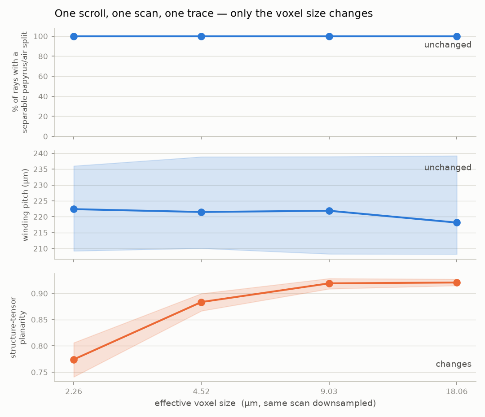
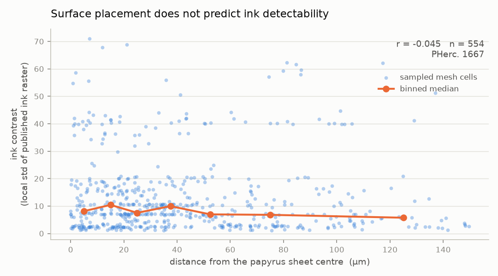
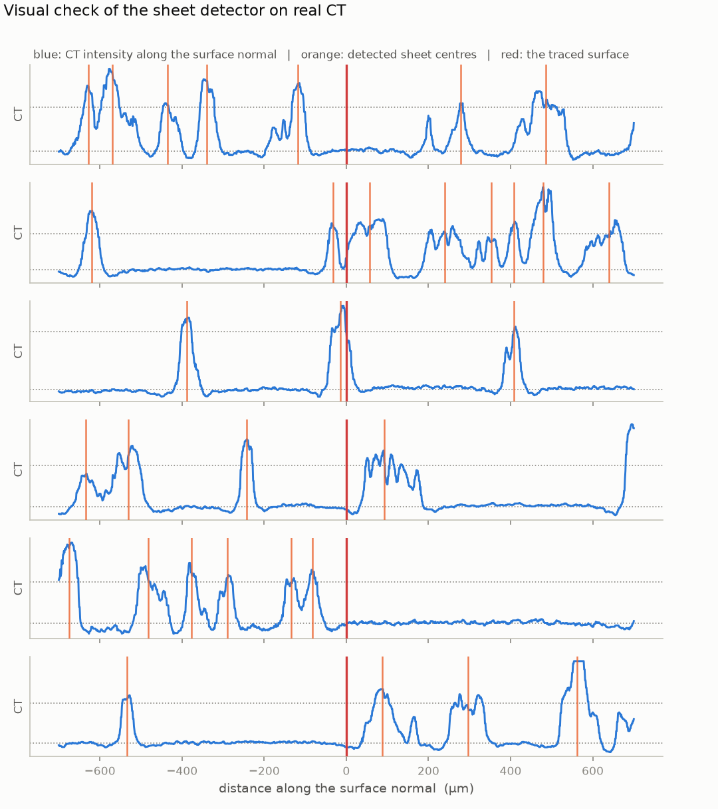

# sheetcheck

Measurements of published traced papyrus surfaces against the CT they were
traced from, streaming from the Vesuvius Challenge open-data bucket.

This repository set out to build a sheet-switch detector. That failed, along
with several other attempts, and one published finding has since been
retracted. What remains is a set of measurements and negative results, ordered
below by how robust each one is, plus the streaming and geometry code that
produced them.

Full detail and method in **[FINDINGS.md](FINDINGS.md)**.

## Ink rasters are pixel-exact with tifxyz grids at 20x

For PHerc1667 segment `20260108140509`, the tifxyz grid is 1975 x 736 with
`scale = 0.05` (20 volume voxels per grid cell) and the published ink raster is
39500 x 14720 -- exactly 20x in both axes. So mesh cell `(v, u)` owns ink pixels
`[20v : 20v+20, 20u : 20u+20]`, with no registration or interpolation.

This is arithmetic on published shapes, checkable in seconds, and it is not
documented anywhere I could find. It makes any geometry-versus-ink study
straightforward.

## Loss of wrap-gap structure is a scroll property, not a sampling artefact

One scroll resolves a papyrus/air split on only 2% of rays while others manage
100%. The obvious reading -- that it is the only one scanned coarsely -- is
wrong. Degrading a fine scan through the OME-Zarr pyramid, holding scroll,
segment, trace and scan fixed, leaves gap structure at 100% even at 18 um
voxels, which is *coarser* than the 2% scan:



## Planarity is resolution-dependent and unsafe to compare across scans

The same data at different pyramid levels gives planarity 0.77 -> 0.92 over an
8x voxel range. Ranking scans by planarity therefore produces a resolution
ranking wearing a quality label.

Both of these are controlled experiments -- one input, one variable changed --
so a systematic error in the measurement affects both arms equally and the
comparison survives it. That is why they sit above the next result.

## Surface placement does not predict ink detectability -- with a caveat

Using the 20x alignment above, placement and ink can be compared cell by cell.
Across offsets spanning 0-150 um on PHerc1667, the correlation with ink
contrast is **-0.045** (n = 554):



Open Problem 6 lists six candidate causes for ink models failing to generalise
and states they cannot be told apart. This is evidence against *surface
misplacement* being one of them, which is consistent with ink models sampling a
stack of layers around the surface and so tolerating modest offset.

**The caveat, stated plainly.** The offset axis comes from `find_sheets`, which
detects papyrus as runs of high intensity. Papyrus is two plies, and if a sheet
is sometimes split into two runs then the "sheet centre" can be a ply centre
instead -- an error of order 25 um, against measured offsets of 26-37 um. A
null result on a noisy axis is weaker than a null on a clean one. I have not
ruled this out, and the honest reading is "no relationship detected with this
measure" rather than "no relationship exists".

## RETRACTED: the winding-pitch measurement

An earlier version reported a pitch of 213-230 um across four scrolls with every
interval excluding the commonly cited 187.3 um. **Withdrawn.**

[IyanDopico](https://github.com/IyanDopico/vesuvius-sheet-tools) found a
monotonic 136 -> 259 um radial gradient on PHerc. Paris 4 (706 human-annotated
pairs) where this repository was flat, with a PHerc1218 control (9,054 pairs)
flat to 1.001 that rules out bias in their own measure.

The cause is characterised in `scripts/m9_pitch_calibration.py`. The estimator
is exact on periodic signals, but real scroll rays are aperiodic -- spacing
varies along a ray, sheets are missed, wraps merge -- and measure
autocorrelation strength around 0.22. At that aperiodicity:

| true pitch | strength 0.82 | strength 0.20 (real data) |
| --- | --- | --- |
| 140 um | 140 | **197** |
| 180 um | 180 | **224** |
| 220 um | 220 | **251** |

Biased high by 30-60 um, worse for tighter packing, dynamic range compressed
toward the search-band midpoint. That reproduces the retracted numbers exactly
and explains why the radial trend looked flat.

**The transferable lesson: do not use signal periodicity to measure wrap pitch
on scroll CT, and calibrate any estimator at the irregularity of the real data
before publishing a number from it.** Validating on clean synthetic signals is
not enough -- this one passed that test and still failed.

## Things that were tried and did not work

Recorded because knowing which approaches fail has value, and each was tested
before being abandoned:

| Attempt | Outcome |
| --- | --- |
| Sheet-switch detection by azimuth holonomy | Works on an isolated winding (0/113 false positives), fails on a merged multi-turn trace (~35%). Azimuth is not a winding coordinate on a crushed scroll |
| Recto/verso ply classification from fiber orientation | No signal: 0.1 deg swing across the sheet, in-plane linearity 0.10-0.16 |
| Predicting annotator disagreement from local CT | Best AUC 0.58 across four metrics |
| Off-papyrus runs to localise sheet switches | Inconclusive; the support metric was miscalibrated at the time |
| Repairing connectivity after CT masking | No problem to repair -- phantoms are spatially segregated outside the scroll, and masking leaves interior components untouched |

## What the measurements look like on real CT



Blue is CT intensity along the surface normal, orange the detected sheet
centres, red the traced surface. The detector lands on genuine peaks. The trace
sits on a sheet in some rays and in a low region in others.

This also exposes a limitation the summary statistics hid: rays 1 and 5 contain
large featureless stretches yet still pass the gap-structure test, because the
other half of the ray carries enough contrast. `gap_structure_frac` is a
per-ray verdict, not a guarantee that a whole ray is well-resolved.

## Install

```bash
pip install -e .              # measurement library
pip install -e ".[figures]"   # also the figure scripts
```

Python 3.10+. No credentials needed -- the open-data bucket is read
anonymously.

```bash
python scripts/m3_survey.py --scrolls PHerc1667 --patches 10
pytest tests/
```

## What it measures

| Quantity | Meaning |
| --- | --- |
| `support` | Where a traced point sits between the ray's air-gap level (0.0) and its papyrus level (1.0) |
| `offset_um` | Distance to the centre of the nearest papyrus sheet. See the ply caveat above |
| `gap_structure_frac` | Fraction of rays where papyrus and air are separable at all |
| `planarity` | Structure-tensor sheet-likeness. Resolution-dependent -- do not compare across scans |
| `pitch_um` | **Unreliable, do not use.** Retracted; see above |

## Design notes

**Everything is local.** Azimuth about a fitted scroll axis is not a usable
winding coordinate: on PHerc1667 the radius wanders about a fitted spiral by
roughly four times the wrap spacing, so advancing 2*pi in azimuth does not
reliably land one wrap later. Every quantity that needed a global winding
coordinate was removed.

**Ambiguity is reported, not resolved.** A ray crossing almost no air has no
meaningful papyrus/gap threshold; rather than let Otsu split the papyrus
distribution against itself and return a confident-looking number, those rays
are reported as having no measurable gap structure.

## Tests

25 tests pin the measurement primitives against synthetic ground truth. Each
corresponds to a bug that occurred during development. Note the limits of this:
the pitch estimator passed its synthetic tests and was still wrong on real data.

## Data

Reads `s3://vesuvius-challenge-open-data/`. Surfaces are `tifxyz`, volumes are
multiscale OME-Zarr. Decoded meshes can be cached via
`Surface.load(..., cache_dir=...)` -- full-scroll meshes are large (the merged
PHerc1667 trace is 2061 x 30097) and slow to refetch.

## Licence

MIT.
